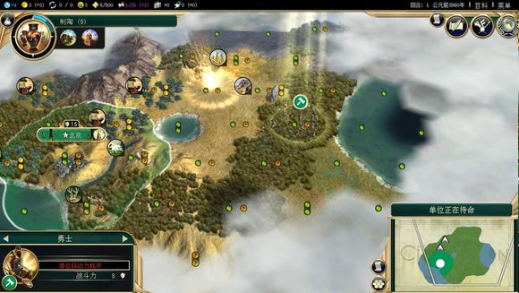
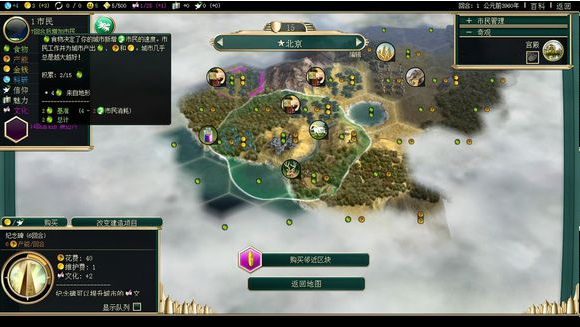
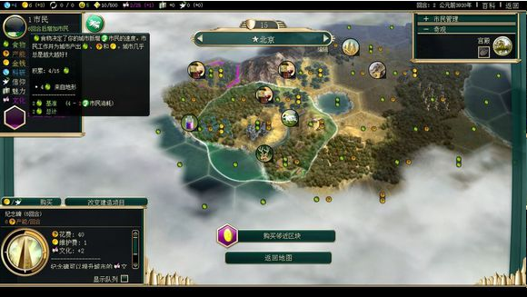
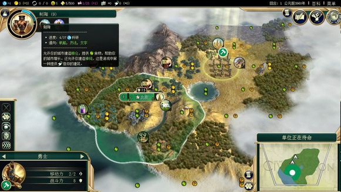
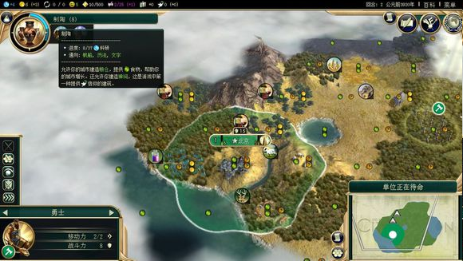

# 第一部分 入门基础。

本部分主要解释一些比较基础的东西，也是新人经常有疑问的地方，共有七个问题。

## 一、对新人的忠告

### 1.1 熟悉游戏机制

玩游戏自然要懂其规则，尤其是文明5这类策略游戏更是如此，了解规则，利用规则才能玩好游戏。

文明5这个游戏的一大好的地方，就在于，当你不懂什么的时候，把鼠标放到想了解的地方，往往就有对应的解释出现，非常方便。

了解规则的主要方法是看游戏自带的文明百科，文明百科基本收录了全部的显示出来的游戏规则和数据，建议玩家在玩之前先通读文明百科，事实上，很多新人玩了好多盘总结出来的“经验”就在文明百科里写的清清楚楚，看百科可以少走冤枉路。

另外本帖收录了大部分没有在文明百科里写明的一些问题，也可以看一看。

### 1.2 多玩，多练，多看，多体会

有时玩家问的一些问题我们很难做出回答，什么怎么拿快乐啊，怎么赚钱啊，怎么打仗啊，选什么政策，信条啊，这些问题根据情况答案不一样不说，很多都是一些很难说清的经验，有些东西，即使说了也没用，关键还是玩家自己多玩积累经验，而学习别人的战报也是好办法，吸取别人的长处，搭配自己的经验才是进阶的王道。

### 1.3 保持好的游戏心态

乐趣：觉得怎么好玩就怎么玩，其他的都是次要的，如果你实在觉得文明5不好玩那就换游戏吧。

真实性：你不是因为它真实你才玩它，而是因为它好玩你才来玩的。

难度：玩游戏开心重要，不要纠结于难度，打不过就换低难度，开心就好，而过了神的也别骄傲，神级only the beginning,后面的路还很长。

### 1.4 切莫追求普适

新玩家刚开始玩的时候总希望找一种普适打法，希望可以一套战术对付所有情况，可以打赢所有难度。

但事实上呢，追求普适打法反而是一种很错误的做法，原因有以下几点。

从真正的实用度上讲，真正的普适打法只有一种：随机应变，而所谓的普适打法要么是只能在特定情况下起效，换一种情况就不行了。要么则是能针对大多情况，但打法本身就是包含了大多数打法的另一种随机应变，而且由于限制了某些要素，使打法变得低效，而低效有时就意味着失败。

从提高水平上讲，一个玩家真正的水平要体现在很多方面，种田，打仗，外交，控制笑脸等等，一直使用一套打法，就会造成在某些项目上的短板，无法使水平得到真的提高。

从游戏性上讲，文明5一大有趣的地方，在于它有无限的可能，43个文明，几十张地图，而且就算选择了同类型地图每回开出来的图也都不一样，而且就算是同一张图，几套不同的打法，甚至是前期斥候走的方向差上一点都会是不同的走向，在这无限的可能中，面对不同的情况随机应变才是游戏的乐趣所在，一直只用一招只会让游戏变得索然无趣，将失去文明的精华所在，这样的文明5，不玩也罢！。

## 二、常用术语，简称，别号等

### 2.1 文明领袖

媚娘：中华领袖武则天。

小贝，马脸，小萝莉（某人提议的）：西班牙领袖伊莎贝拉。

小白：英格兰领袖伊丽莎白。

大妈，奥地利领袖特蕾西亚。

砍二：阿兹特克领袖蒙特祖玛。

关二：巴比伦领袖尼布甲尼撒二世。

大波：俄罗斯领袖叶卡捷琳娜。

人妖，发哥：暹罗领袖兰甘亨。

阿三：印度的领袖甘地。

花生（炖）：美国领袖华盛顿。

98女，酒吧女：凯尔特领袖布狄卡。

拖鞋男，啪嚓哭啼：印加领袖帕查库提。

乞丐哥：玛雅领袖帕卡尔。

内裤男：波利尼西亚领袖卡美哈梅哈。

狮子头：瑞典领袖古斯塔夫·阿道夫。

破轮：法兰西领袖拿破仑。

小胖：印度尼西亚领袖加查玛达。

铁相：德意志领袖俾斯麦。

油霸：阿拉伯领袖哈伦阿希德。

小黑：埃塞俄比亚领袖海尔塞拉西。

海哥：易洛魁领袖海华沙。

法老：埃及领袖拉美西斯二世。

橘子头：荷兰领袖威廉奥兰治。

鸭梨：希腊领袖亚历山大。

大汗：蒙古领袖铁木真。

老疯婆：葡萄牙领袖玛利亚一世。

注：这里不解释为什么这么叫，另外不同叫法很多，楼主这里只是举比较通行的说法。

### 2.2 英文简称

T：Turn 回合。

DLC：Downloadable Content 可下载资料片。

GK:Gods Kings 神佑君王，文明五第一部资料片。

BNW:Brave New World 美丽新世界，文明五第二部资料片。

UU:Unique Unit 特有单位。

UA:Unique Ability 特有能力。

UB:Unique Building 特有建筑。

UI：Unique Improvement 特有设施。

MOD：Modification 游戏增强程序，也称模组。

TJ：Tai Jian 太监，也就是没打完就不玩了。

GG：Good Game 在职业竞技比赛中打出有认输的意思。

G：Gold 金，即金钱。

IGE：Ingame Editor 游戏编辑修改器，一种可以边玩边修改的MOD，功能很强大，毁游戏圣手，除测试外不建议玩家使用。

AI：artificial intelligence 人工智能，这里指电脑玩家。

RA： Research Agreemnt 科研协议。

SDK：Software Development Kit 软件开发工具包，在文明五是地图和MOD的编辑器。

GPT：Gold Per Turn 即回合金，也就是你的财政收入。

SL:Save Load 即保存，读档。

### 2.3 世界奇观和自然奇观

世界奇观里像大金字塔简称大金，神谕所简称神谕的就不解释了。

阿尔忒弥斯神庙：吃货庙，弓箭庙，月庙，粮食庙。

勃兰登堡门：经验门。

奇琴伊察：齐秦。

太阳神巨像：大铜人。

大报恩寺塔：大陶塔。

自然奇观。

乌鲁汝：面包山。

维多利亚湖：吃货湖,大妈湖。

乞力马扎罗山：蚂蚱山。

喀拉喀托火山：科研火山。

宗教山：西奈山，吉罗娑山，乌鲁汝，圣足山这类提供大量信仰的自然奇观。

### 2.4 常用术语

暴铺：多铺城，靠更多城市发展国力的打法。

精铺：少量铺城，专注发展少量优质城市的打法。

魔王流：顶着大量红脸继续推进。

蘑菇：指不铺城，光发展的AI或玩家，就好像蘑菇一样等人采，另外有时也指远古遗迹。

种田：发展自身经济。

骗宣：将手中按回合交付的的资源等换AI手中的现金后宣战，这样你拿到现金而Ai什么都得不到而你获得了现金，在BNW改版后，因为不宣友不能交易现金而作用大大降低。

买宣：用金钱等交易让AI宣战别人，具体方法后面会提到。

背刺：长期友好或中立后突然敌对或宣战。

开门：启用一个政策树，启用一个政策树会有对应效果。

关门：采用完一个政策树所有的政策，这样也有对应的效果 。

黑科技：几乎打破游戏平衡的某种东西,经常用来说宗教改革。

刮刮乐：劫掠地块设施。

黑箱子：文化速胜流打法。

### 2.5 单位的简称

猴子：侦察兵。

小矛，叉叉：矛兵。

棒子：勇士。

妹子：工人。

小弓：弓箭手。

纸飞机：三翼机和早期轰炸机。

三条棍：三列桨战船（五条棍同理）。

加特林：多管机枪。

马克辛：重机枪。

巴祖卡：火箭筒。

高达：末日机甲。

ggx2。

吧主14。

## 三、关于奢侈资源

### 3.1 奢侈资源提供的快乐

每获得一种奢侈资源将获得4全局快乐（移民难度为5），可以通过商业右三提高这个数值。

只要你依然拥有一份某种奢侈，就可以获得该种奢侈的快乐，。

### 3.2 奢侈资源的产量和交易

每个奢侈地块的产量均为1，例外地，印尼有特殊奢侈的城其奢侈的奢侈产量为2。

在与交易时，两边显示的奢侈都是对方没有的种类，后面的数字显示你拥有的产量，也就是说，一旦你把后面是1的奢侈交易出去，你就将失去这种奢侈，不再从中获得快乐直到交易结束或者你又通过别的手段获得这种奢侈。

### 3.3 特别的奢侈

珠宝，瓷器只能通过同盟商业城邦得到。

肉豆蔻，胡椒，丁香是印尼UA所赋予的特种奢侈。

### 3.4 大理石

有大理石的城市将获得15%的远古古典奇观建造加速。

### 3.5 关于坐奢侈

如果你拥有开发该奢侈的科技，当你在其上建城时将视为开发，如果你没有对应的科技，当你拥有科技时奢侈将被自动开发。

## 四、关于战略资源

### 4.1 问：如何获得资源

答：你需要在你境内的资源地块上修建相应的开发设施，当设施正常时就可以得到资源了。

### 4.2 问：什么时候马能再生产一个?/为什么我交易几个马还有时间？

答：这里需要明确一下资源生产的概念，在战略资源上标的数字并非指该资源的个数，而是指其产量，事实上，文明5的资源系统就是以产量为资源的基本单位的，单个的资源（例如一队马）在游戏里不存在。

而战略资源和单位，建筑的关系并非是建造建筑，单位消耗了资源，而是建造时和建造完成后，单位和建筑占用了一个单位的资源产量。

通俗理解：你的骑兵每十年（前期一回合就十年）怎么也要换次马吧？你的剑士们要换把剑吧？你的工厂每天都要烧煤吧？战舰，飞机，坦克都要烧油吧？。

好了，理清这些一些问题就可以回答了。

### 4.3 问：为什么缺乏战略资源会导致已经造好的单位战斗力下降？

答：两者是供应维持的关系，当你的骑兵马都老了伤了得不到更新，当你剑士们剑已经锈迹斑斑而无法更换，当你的飞机，坦克缺乏油料，你觉得他们战斗力还能维持吗？。

### 4.4 为什么飞机是石油造的，工厂是煤造的？

这个，，，，。

### 4.5 资源能再生产吗？为什么我感觉能呢？

资源的本身产量是不会改变的，不过有些政策可以在其基础上提高产量，之所以感觉能，往往是因为不经意间开发了新资源点，以及你的部队升级换代后资源不再使用了（比如马和铁后期就无用了）。

### 4.6 缺乏资源的后果

战斗单位会因为缺乏资源供应导致战斗力下降，数值为50%*（所缺资源数\总所需资源数）。

城市建筑不会因缺乏战略资源而失效。

## 五、关于奇观

这里指的是城市里建造的奇观。

### 5.1 奇观的类别和不同

奇观分世界奇观，国家奇观，工程奇观三种。

其中世界奇观全游戏只能有一个，一旦有人建成，其他人就不能建了，正在建的也会立即被停止，损失的产能化为金钱，另外就算你摧毁了建造了世界奇观城市，你也不能再建造这个世界奇观。

而国家奇观和工程奇观每个人都可以建一个,。

### 5.2 怎么判断一个奇观是国家奇观还是世界奇观

一般国家奇观会要求你所有城市都有某个建筑，稍微上手一些的玩家应该记住哪些是国家奇观哪些是世界奇观，可以在文明百科里查到。

三个艺术家公会不属于国家奇观，但你只能造一个，这里的机理有待考证。

工程类奇观就两个不用分辨了吧。

### 5.3 奇观的修建条件

多数奇观没有修建的条件，有修建条件的分政策类和地形类。

### 5.3 .1政策类

新资料片对一些奇观的修建有政策上的要求了，你需要开启相应的政策树或意识形态来获得修建奇观的许可，具体如下。

空中花园--传统。

宙斯神像--荣誉。

大金字塔--自主。

杰内大清真寺--虔信。

紫禁城--赞助。

乌菲兹美术馆--美学。

大本钟--商业。

罗浮宫--探索。

大报恩寺塔--理性。

自由女神像--自由。

普罗拉度假村--独裁。

克里姆林宫--秩序 。

### 5.3 .2地形类

需要沿海建造的有：大灯塔，青铜巨像，悉尼歌剧院。

需要城市两格内有在国境内的山脉的有：新天鹅堡，马丘比丘。

需要在或靠着荒漠的：佩特拉城。

需要建立在宗教圣城的（这个其实不算地形，但在此一并说了）：婆罗浮屠,。

### 5.4 奇观的唯一性

世界奇观全局只有一个，并且无法被重建，一旦你摧毁了有世界奇观的城市，那这个奇观就永远消失了。

国家奇观你只能拥有一个，当你攻下有国家奇观的城市时，城市的国家奇观会被自动摧毁。

### 5.5 奇观的效果

奇观的效果分两部分：即时效果和持续效果。

例如大图书馆，免费的科技是即时的，加的科研是持续的，，，，。

攻占有奇观的城市将无法得到即时效果，但可以得到持续效果。

需要说明的是，当你没有开启一政策树却攻占了有对应奇观的城市时，奇观的效果依然存在。

### 5.6 如何抢奇观

通过注重产能等手段提高自己的产能，通过砍树来获得一次性的产能,当然大工最给力了，，。

另外你可以通过AI所开政策来判断其有可能抢什么奇观，这里需要说明的是在全球政治栏目里不显示政策开门，所以，，，。

通过间谍可能知道对手在建什么奇观，而有经验的玩家可以看见AI城市里的奇观工地，从而知道情况，这里附上奇观的地基模型总结，感谢头神。

http://tieba.baidu.com/p/2783689275。

### 5.7 关于“遥远的国度”

当奇观在任何一个你没有发现的城市建成时都会显示“在遥远的国度建成”，无论你是否发现了那个文明。

## 六、产出积累进槽

### 6.1 地块的产出

产出就是指那些地块上的食物，锤子什么的。

每个地块都有它的产出，游戏的进行，主要就是靠积累产出进行的。

注意，要区分产出和资源的含义不同。

地块的产出可以通过打开产出图标看得很明白，不同的产出用不同的图标区分开，其个数就代表了该地块该产出的数量（高于5时则会变成单个大图标），例如在上图中，勇士所站的地块的产出为1食物1产能。

，其左上的象牙地块就是1食物一产能2金钱，北京右面的那个羊的地块产出就是1食物2产能。

### 6.2 地块产出由市民工作得到

地块上有产出，但是这些产出（除了很特别的快乐产出之外）都是要靠市民在地块上工作得到的，毕竟地块在哪里空放着，没人工作，怎么会有产出呢？。

不过这点和资源的生产有区别，资源的生产只需有设施在上面就可以了。

### 6.3 产出积累进槽

每回合，你所得到的各项产出，均被积累进对应的槽里。

如图所示，在上图中可以看到楼主该城的食物最后的积累量是2，那么到下一回合，城市的食物槽里就多了2食物，类似的可以看到底下的纪念碑建造所需的时间又少了一回合。

同样的，在全局情况来看，科研产出加进了科研的进度增加了4，金钱产出加进金钱量也多了3，文化产出加进文化点数也多了1，这就是产出的积累。

产出积累进槽是游戏的核心系统，通过不断得积累各项产出，达成一个个目的，更多的人口，更多的建筑，部队，更多的金钱，更高的科技，建筑，一切的一切都是这样一点点积累起来的。

### 6.4 产出的加成

包括产出的加成在内的游戏的绝大多数加成都是叠加型的，其计算方式是这样的，首先计算基准值，把所有以数字显示的增加量加起来为基准值，然后将加成加起来为总加成，比如在计算科研时，假设你的城市有大学和天文台，加成就一共是33%+50%=83%，最后基准值乘以（1+总加成），当然，各种加成有的有区别，玩家自己注意。

## 七、游戏的胜利

游戏设定给玩家的目标就是获得胜利，在文明5里想获得胜利有五种方式，在创建游戏的高级选项里，你可以选择取消掉一些胜利方式，这么做会导致该种胜利无法被达成，也会产生别的影响。

当一个玩家率先达成某种胜利时，游戏就以该玩家胜利而告一段落，而当一种胜利被达成后，其他人将无法胜利，也无法完成纯胜利动作，因为游戏从某种角度讲已经结束了。

如果你其他胜利了，其实你还可以征服胜利一次，别的就不行了。

### 7.1 征服胜利

描述：用你的军队打败所有敌人，征服这个世界！。

达成条件：将所有文明的初始首都掌握在自己手里。

### 7.2 科技胜利

描述：大力发展科技，以高科技发射飞向半人马座的飞船！。

达成条件：建造好六个飞船组件并在首都将其组装上发射架，而建造飞船组件的前提条件是完成阿波罗工程。

取消后果：如果科技胜利被取消将使玩家不能建造阿波罗工程，另外，如果游戏已经结束，则建造好的组件不能组装上首都的飞船发射架。

### 7.3 外交胜利

描述：通过卓越的外交手段成为世界领袖！。

达成条件：在世界领袖选举中胜出，而世界领袖选举是在世界进入原子时代才会开始的。

取消后果：世界进入原子时代后，世界议会不会进行世界领袖选举，但世界议会的开启不受影响，另外，如果游戏已经结束，则不会再进行世界领袖选举。

### 7.4 文化胜利

描述：用自己文化的无穷魅力征服世界！。

达成条件：当你对一个文明积累的魅力超过其自身的文化积累时，则称你对其的文化影响达到了“无远弗届”的程度，而当你对所有其他文明的影响力都达到“无远弗届”时，你就达成了文化胜利。

### 7.5 时间胜利

描述：，，，，，。

达成条件：在2050年到来时分数最。
