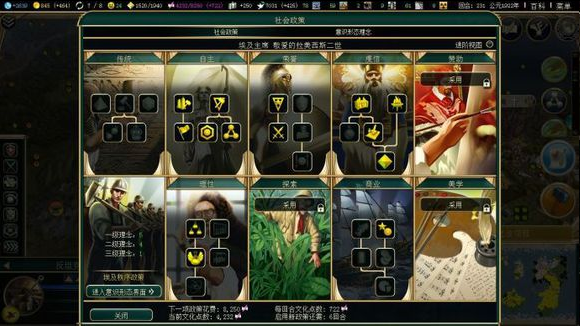
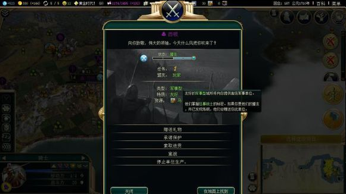

# 第三部分 系统初解

本部分解释几个主要的游戏系统，共计十三个问题。

## 一、政策系统

政策系统时游戏的核心系统之一，玩家通过积累文化，开启新政策，利用政策的效果增强国力，进而达成胜利。

点开右上角左数第二个按钮，就能看见如下的图，这就是政策系统的界面。

### 1.1 政策的获得

主要的手段是通过积累文化来获得，有些奇观，国际盛事，意识形态的开启等会赠送免费政策，特别提醒，意识形态开启获得的政策只能用来采用意识形态信条。

总的讲，由于采用政策的文化成本会随政策的不断开启而上升，事实上一场游戏下来能开启的政策不会很多，开完基本别想，所以开的政策往往就决定了你的打法走向，尽管所有的政策的效果都是正效果，但你依然要谨慎选择自己要开的政策。

### 1.2 政策的分类，简称等

政策分两大类，社会政策和意识形态信条，社会政策间相互不冲突，而三大意识形态间冲突，只能开启一种。

社会政策一共分九个政策树，也就是上图中看到的除左下角外的九个大框，每个政策树均包括五个政策，算上开启政策树，玩家一共要花六次开政策的机会才能开完一个政策树。

政策间的前提关系用线表示得很明白。

开启政策树被称为“开门”，政策树开门都有对应的效果，例如上图中楼主的传统政策就只是开了个门。

采用完一个政策树称为“关门”，政策关门也有对应的效果而且往往很强力，例如上图中楼主的自主政策树就关门了。

尽管政策都有自己的名字，不过为了简便起见，一般都以政策树名字加该政策在政策树中的位置来称呼，例如荣誉政策树右下角的“职业军人”政策就被叫做“荣誉右三”。

### 1.3 政策的选择与导向

其实选择遵循的原则很简单，就三个字：看情况。

多的不能再说了，文明5每局都不一样，一定要根据实际情况和你的打法需要来选择政策。

至于导向，政策的介绍其实也说得比较明白了，自己看着选吧。

## 二、关于世界议会

### 2.1 世界议会的开启

世界议会的开启需要一个玩家达成如下目标：。

1，研发了印刷术科技。

2，发现了所有其他文明。

当有一个玩家达成上述两项目标时，世界议会开启，该玩家成为第一届的东道主，所有文明将相互见面。

### 2.2 提案的生效与撤消

当提案表决通过后就生效了，想撤消他，需要再提议案将其撤消。

世界议会的表决结果无法被“拒绝执行”。

### 2.3 关于代表权的数量

积累城邦盟友是得到票数的主要方式。

随时代各国的票数变化：依次是启蒙，工业，电气，原子。

东道主：2,3,5,6。

文明：1,2,3,4。

城邦：0,1,1,2。

另外的票有：。

紫禁城奇观：+2。

世界宗教：+2。

世界意识形态:+3。

全球化科技：每个外交官+1。

### 2.4 关于买票

你需要在其他文明放外交官才能买票，买票并不意味着他将把全部票投给你，他只会投一部分票,另外买票不妨碍他把剩下的票投向另一面。

### 2.5 关于东道主改选

世界进入新时代时将自动重新选举东道主，你无法在当回合通过买城邦获得票。

而原子时代的改选是最后的改选，之后不会再改选东道主。

### 2.6 世界议会与外交胜利

取消外交胜利不会取消世界议会，只是世界议会将不会自动发起世界领袖选举。

### 2.7 关于世界工程

世界工程所需的产能是按文明数决定的，例如世博会在标准状况下是每文明350产能，不过由于不同情况下这个数值会变化，你可以在游戏中打开文明百科在世界议会那里查看当局游戏每文明的产能数，文明消亡不会降低其数值。

具体的奖励请看说明。

## 三、关于商路

### 3.1 商路数量

科技和奇观可以增加商路数量，具体为:。

科技：家畜驯养，帆船，工程学，罗盘，银行，生物学，铁路，青霉素。

奇观：青铜巨像，佩特拉。

### 3.2 商路单位无法组建的问题

有这么几种可能：。

1，你的商路达到上限了。

2，系统发现以你现在的情况就算这单位建好了你也无法拿这单位组建一条商路。

### 3.3 国际商路的收益

商路发起方收益：（1+己方城市GPT/20+对方城市GPT/20+商路相关建筑收益+差异资源数量*0.5）*本城沿河、靠海百分比加成。

商路接收方收益：（1+商路相关建筑收益）*本城沿河靠海百分比加成。

其中资源差异数量就是所谓的资源多样性。

瓶子数=对方研究的自己不知道的科技数/2向上取整加上通过魅力系统获得的瓶子。

如果商路链接的城市不在自动传播宗教的范围内，则商路将会传播宗教，即施加一城单位的宗教压力。

### 3.4 商路的劫掠

你需要与该商路的主人开战，然后把军事单位放到商路单位上就可以劫掠了。

## 四、蛮族和遗迹

在百科里有相关介绍，这里只提一些要点。

### 4.1 蛮族

蛮族驻防单位没有回血能力，楼主干过拿猴子干掉一小矛的营地，，，，。

玩家对蛮族有战力加成，这个加成随难度降低而增高。

蛮族的科技是75%的文明研发该科技时蛮族自动获得。

现在蛮族什么单位都会出，遇到什么骑手从阴影里冒出抢走妹子的，，，，。

当一个单位经验超过30后，就不能通过和蛮族作战获得经验了。

### 4.2 远古遗迹

所有单位踩到升级都是按升级链直接升一级，特别的，勇士会升级为矛兵，斥候会升级为弓箭手（肖肖尼的UU会升级为复合弓）。

遗迹的奖励是三循环的，也就是你踩到一奖励后最少在第四次踩遗迹时才会踩到同一奖励。

遗迹给信仰的奖励受你是否选择了神系有关，选择了给的多，没的话就少了。

## 五、意识形态和其红脸

### 5.1 意识形态的开启

开启有两种条件：。

1，拥有三座工厂。

2，进入电气时代。

对于单城或双城的玩家只好进电气时代了，，，。

开启意识形态时会奖励意识形态信条，第一个开启该意识形态的奖励两个，第二个开启的奖励一个，后面的就没有了，需要说明的是，尽管是以奖励政策的方式给的奖励，但该奖励只能用来开启意识形态信条。

### 5.2 意识形态红脸

一个文明对自己所选意识形态的 公共舆论是由某个“受影响点数”决定的。

记默默无闻为0点，初具风情为1点，口耳相传为2点，广受称誉为3点，无远弗届为4点，完全控制为5点。B文明对A文明的影响等级对应点数多于A文明对B文明的影响等级对应点数时，B文明对A文明产生影响，相应的影响等级对应点数之【差值】即为B文明对A文明之影响点数。表现为“魅力总览”界面里“文化胜利”那一栏中鼠标移到 公众舆论状态上的时候那些火炬、锤子、剑的数目。

世界议会选出的世界意识形态会对所有有意识形态的文明造成2点相应意识形态的影响。

对某一个文明，由其受不同意识形态的影响点数之和减去其受相同意识形态的影响点数之和，差值决定了公众舆论的等级。小于等于0时为心满意足，1和2为秉持异议，后面的暂时没归纳出来。

至于那个红脸，是这样的，每个城市的不满，或者全国的不满，取最大值。

上面引用了吧友的总结。

另外，吧友也可以看这个[帖子](http://www.civclub.net/bbs/viewthread.php?tid=123462&extra=pa)。

## 六、升级链及兵种普遍特性及升级情况

这里只给出在升级链上的兵种，部分兵种并不在任何一条升级链上。

绝大部分情况下，当你拥有组建升级链上下一个单位的科技时，上一个单位将过时而不能组建。

另外下面谈到战力说的是基础数值。

### 6.1 步兵勇士---剑士---长剑士---火枪手---来福枪兵---早期现代步兵---现代步兵---机械化步兵

特点：步兵系是战斗的主力，都属于近战单位，普遍2移动力（除最后的机械化步兵3移动力），其速度不高，战力够高但没有任何加成，可以驻防。

### 6.2 弓兵/机枪弓箭手---复合弓手---弩兵--O--多管机枪---重机枪---火箭筒该系的共同特点是2移动力，远程攻击，都可以驻防

弓兵系的特点是2射程，其近战战力大概只有远程战力的三分之二，比较脆弱，需要好好保护。

机枪系的特点是1射程，近战战力与远程战力相同，略低于同时代步兵。

### 6.3 骑兵/坦克

战车弓手/骑手---骑士---近代骑兵--O--履带战车---坦克---主战坦克---末日机甲。

该系的共同特点是高移动力和近战的作战方式（战车弓手除外），另外都需要资源来维持，都能在攻击后移动（战车弓手再除外），能在攻击后移动的特点和高移动力使其生存能力很强，而且可以突袭敌人的远程单位。

骑兵系的特点是都需要马资源来维持，近战骑兵在攻城时会受到33%的战力惩罚。

坦克系特点是需要石油，铝，铀资源来维持。

### 6.4 枪兵/反坦克单位矛兵---长枪兵---枪骑兵--O--反坦克炮---武装直升机

该系的共同特点是对骑兵/坦克系有作战加成。

矛兵和长枪由于其科技线好，所以是前期战争的步兵主力，枪骑的升级还算可以，但是后面的反坦克炮和武直因为科技线的问题出场的不多。

### 6.5 压制武器

投石车---抛石车---加农炮---火炮---火箭炮。

特点：2移动力，对城市有200%的攻击加成，用来攻克城市很好，前三个射程只有2且没有间接火力晋升，前四个开火前需要准备，部署的时候注意走位，。

### 6.6 远程海军

桨帆战舰---巡航舰---战列舰。

特点：不俗的战力加远程让其成为海战的主力。

### 6.7 近战海军

三列桨战船---轻帆船---铁甲舰---驱逐舰。

私掠舰---驱逐舰。

特点：近战海军有力地保护了远程海军，另外由于攻占城市的需要，近战海军不可或缺，另外，一般私掠舰是近战的主力。

### 6.8 轰炸机与战斗机

早期轰炸机---轰炸机---隐性轰炸机。

三翼机---战斗机---喷气式战斗机。

都是前两个需要石油，最后一个需要铝。

轰炸机是对敌战斗的主力，拥有较长的射程，战斗机则提供辅助，另外战斗机可以提供视野。

### 6.9 防空与伞兵与潜艇

高射炮---防空导弹车。

伞兵---幽浮小队。

潜艇---核潜艇。

特点：防空单位对飞机有加成，可以在敌机来犯时进行防空。伞兵在国境内可以向外进行空降，用来夺岛和突袭很不错，XCOM小队是无敌的存在可惜文明5没展现出来，潜艇能有效消灭敌海军，但面临攻击时比较脆弱。

## 七、关于伟人

### 7.1 伟人的分类

伟人分城市伟人，军事伟人，宗教伟人，城市伟人又分内政伟人，文化伟人。

具体如下。

城市伟人：内政伟人：大科学家，大工程师，大商业家。

文化伟人：大美术家，大音乐家，大文学家。

军事伟人：陆军统帅（大军事家），海军统帅（提督）。

宗教伟人：大先知（大预言家）。

伟人的简称就是前两个字：大科，大工，大商，大美，大音，大文，大军，提督，大仙。

### 7.2 伟人的获得

城市伟人是通过在城市里的伟人槽里积累伟人点数将伟人槽装满获得的。

城市伟人的伟人点主要来自市民在专家席位工作，一些奇观和建筑（这里指三个公会）可以提供伟人点数或加快其积累。

军事伟人有全局性的伟人槽，伟人点数是部队获得的经验的和，积累的进度可以在单位列表里查到，，，，。

大先知的出现将在宗教初解里说明，这里不做赘述。

除了填伟人槽，一些奇观，政策也会赠送伟人， 。

在赞助关门后，城邦偶尔也会送伟人，一些政策树开满后或者有荣神益人宗教改革信条的城市可以用信仰买伟人，其价格随购买将增长。

### 7.3 伟人槽的问题

诞生伟人所需要的伟人点数随伟人的诞生会不断上涨。

例如标速下第一个伟人需要100点，第二个就需要200，第三个300，以此类推。

大军事家和提督是200,200得加的（提督不确定）。

这里要说明的是：内政伟人是共用一个值的，而其他的都是分开的。

### 7.4 伟人的使用

这里介绍伟人的技能。

大工程师：1，加速建造：在城市里消耗大工程师瞬间产生300+30*城市人口的产能，这个产能不会溢出，一般用来秒奇观。

2，建立制造中心：在国境内地块上消耗大工程师建立制造中心，地块+4产能，研究化学后再+1，精铺打法下用很多制造中心会让城市的产能高得恐怖。

大科学家：1，研发科技：消耗大科学家立即获得你前8回合科研总和的科研点数，科技胜利的时候可以储备些大科学家，科研最大化8回合然后一起烧掉可以秒杀后面的科技。

2，建立学园：消耗大科学家在国境内地块上建立学园，地块+8科研，研究科学理论后再+2，原子理论后再+2，精铺打法下用很多学园会让城市的科研高得恐怖。

大商业家：1，贸易活动：在没有与你交战的城邦境内消耗大商业家，获得300金钱和30影响力，金钱每前进一时代+100。

2，建立海关：在地块上消耗大商业家建立海关，地块+4金钱，研究经济学后再+1金钱。

大文学家:1，创作：消耗大文学家创作一个文学杰作。

2，写政治论文：消耗大文学家立即获得你前8回合文化产出总和的文化点数，对于缺乏文化或急于开启政策的玩家烧了就不错。

大音乐家1，创作：消耗大音乐家创作一个音乐杰作。

2，巡回演出：在他国国境内消耗大音乐家立即对该国积累一笔魅力点数，其他文明也会受到20%的影响，大音乐家的战斗力为其诞生时你的魅力产出的10倍，在文化胜利时往往最后一个AI是难啃的骨头，用大音去演出可以快速解决问题。

大美术家：1，创作：消耗大美术家创作一个美术杰作。

2，开启黄金时代。

让艺术伟人创作杰作是提高魅力的主要途径。

陆军统帅：陆军统帅周围两格的单位获得“统帅激励”战斗力加成15%，不叠加。

建立军事要塞：在国境内或者边境上消耗大军建立军事要塞，强行将周围一格的领土纳入自己，在其旁边结束回合的敌军单位损失30血量（该效果不叠加），在其中的单位防守时获得100%的战斗力加成，。

海军统帅：海军统帅周围两格的海军单位获得“统帅激励”战斗力加成15%，不叠加。

修补舰船：消耗海军统帅使周围一格内的海军单位和海运单位回满血（这尼玛就是大团补），由于海军只能在自己境内恢复，所以往往一次群补有拯救全局的作用。

大先知：创教：大先知可以在城市里被消耗来创教和强化宗教。

传教：大先知可以传教4次，并且传教时会驱逐别的教的教徒，这是非常稳定的传教。

建立圣地：在国境内消耗未传教的大先知建立圣地，地块+6信仰，建立圣地并虔信关门将提供大量信仰，文化和金钱。

### 7.5 伟人设施和伟人的战斗规则

消耗伟人建立的地块设施称为伟人设施，需要注意的有:。

1,伟人设施也是地块设施的一种，可以被劫掠，被劫掠将失去效果直到被修复。

2，伟人设施可以开发战略资源，但不能开发奢侈资源，事实上，之所以赋予伟人设施开发战略资源的能力，是为了防止玩家在没有科技时在战略资源地块上建立伟人设施，科技有后面临要高产的伟人设施还是要战略资源的尴尬的，而奢侈资源开局就显示了，如果你还要往上坐，，，，。

3，军事要塞的所属判定是以在谁国境内判定的。

4，自由意识形态里的新政信条可以增加伟人设施产出，对应的+4。

5，伟人建立伟人设施称为坐地，弄作品称为创作，另外一个技能往往叫烧，，，，。

伟人均为平民单位,除了大先知在遭遇敌军单位时会被俘虏外，其他的伟人均会被消灭，伟人往往很重要，所以请保护好你的伟人，需要说明的是，陆地上的伟人进入水域后变为海运单位，有一定的防御下战斗力，故而在遭遇敌人海军单位时不会像陆地上一样被“踩死”，但海军统帅作为海上平民单位会被踩死。

一些可以在遭遇近战时有概率撤退的单位不会因为正在保护伟人而坚决与敌人战斗，一旦触发了他们的撤退，伟人将被立即消灭。

### 7.6 伟人的名字的问题 

伟人诞生时会有名字，名字与你所选国家无关，什么中国来个贝多芬，印加来个祖冲之的一点都不奇怪。

伟人名字数量是有限的，当一局游戏出现过多伟人时就会出现伟人无名的情况，对其他伟人没有影响，但对艺术伟人来说，没有名字意味着没有对应的作品，所以这些伟人将不能创作，只能使用其另一个技能。

## 八、科研协定和防御条约

在与其他文明宣布友谊后可以签署科研协定（也就是RA）。

双方各付一笔经费，如果你科技领先他，每领先一个时代多向对方付出100金或等值其他东西。

RA产出为：科研弱势一方三十回合的科研产出的六分之一。

奇观大报恩寺塔和理性左三政策可以对其加成。

防御条约。

签署防御条约后，当你因条约卷入战争时按你主动向对方宣战算。

因防御条约可以在和平条约生效期间对敌开战。

## 九、宗教初解

这里仅对宗教系统做简单介绍。

### 9.1 宗教的创立及完善过程

这个在文明百科里介绍的很全面，请自行查阅，这里只说几个问题。

1，当有人强化宗教且神系数大于允许创建的宗教数时，你就不能创建神系了（AI好像不受限制）。

2，大先知的出现是概率型的，以标速为例，当你积累够200信仰后，每回合大先知出现的几率为（X-195）% 。

X为你积累的信仰值。

3，你可以在宗教界面查看还有多少信仰你可以创建神系。

4，没有神系也可以创教，比如直接造圣索菲亚得到大先知直接传教，神系在创教时选择。

### 9.2 神系与宗教

在判定中神系和宗教有时是一回事，所以可能有以下的情况出现。

1，你的城市一半人信仰你的神系，一半人信仰你的宗教，这时系统会判定该城市没有主流信仰，所以该城市没有宗教的效果，于是一个蛋疼的情况出现了：该城所有人都信一个神系，该城却没有神系的效果，，，，。

2，另一种情况就比较喜感了，如果你开了虔信中二政策，而你的城市神系为主流，宗教为第二信仰，此时系统判定第二大宗教的神系就是你自己的神系，于是你享受双倍的神系效果，，，，。

### 9.3 宗教压力是什么？

宗教的扩散是以宗教压力实现的，具体如下。

每个信仰宗教的城市每回合会向周围十格内的其他城市施加6点（标速）所信仰宗教的宗教压力，对于没有信徒的城市而言，每积累一百宗教压力将转化一个教徒。

你可以通过某些奇观，强化信条来增加压力和范围。

通过形成强大的宗教力场可以迅速的传播宗教，同时抵御其他宗教的侵袭。

同时传教士和审判官也是通过施加宗教压力和清除别的宗教压力来实现宗教传播的，大先知则是两者结合。

具体的作用机制在这里附上链接：。

[吃DLL长姿势系列 第二弹]抛砖引玉 - 文明5宗教系统数值解析。

[url]http://www.civclub.net/bbs/viewthread.php?tid=108861&extra=page%3D2[/url] 这里感谢物件君的总结（无心大这么叫的，，，）。

### 9.4 自己创教和传播自己宗教的好处

自己创教将使你可以选择自己喜欢的信条，来最大程度配合自己的战术思路。

至于传播自己宗教的好处。

传播宗教将使你更多的从创立者信条中受益。

传播到国内可以使更多自己的城市享受追随者信条和改革信条，增强国力。

传播至城邦可使你对城邦的影响力下降速度减慢，详情见百科。

传播至其他没自创宗教的文明将增进外交关系，自动传播至有宗教的文明没有红字也没有绿字。

相同的宗教信仰将使相互间的魅力输出加25%。

### 9.5 常见问题

1，为什么我的城市没有宗教、神系效果？。

请检查该城市的主流宗教是否为你的宗教或神系，另外要说明的是，当你创立宗教后新建的城市将不会自动有神系效果。

2，宗教建筑在改宗后是否消失？。

不消失。

3，改革信条如何获取？。

自己创教并采取虔信中三政策。

4，为什么我攒信仰不出大先知了？。

工业时代后大先知将不会自动诞生，可以花信仰购买。

5，宗教单位建筑的价格。

初始为200，随时代上升。

6，我买了个审判官怎么把自己宗教给洗了？。

宗教单位所属宗教为其出生城市，请在使用前确认其出生地。

7，宗教单位的战斗规则。

陆上遭遇敌军单位一律被俘虏。

8，如何消灭AI的宗教。

最好的办法是灭之，，，。

## 十、关于自然奇观

### 10.1 自然奇观的发现收益。

自然奇观被发现时会奖励玩家1快乐。

黄金国会奖励首先发现的玩家500金。

西班牙什么的就不说了，，，。

### 10.2 奇观的产出。

自然奇观的产出都不虚，至少都是5，在游戏初期还是不错的，而其中一些甚至有全局的影响。

自然奇观的产出除快乐外都需要市民在奇观地格工作得到，而快乐产出则只需圈进国境就可以了。

有些吧友问“为什么我把奇观圈进去了没得到信仰啊？”看了这个就懂了,。

### 10.3 奇观给部队的特殊晋升。

青春泉会使部队所有临近的单位自动获得回血速度加倍晋升。

乞力马扎罗山会使部队所有临近的单位自动获得高山操练晋升：丘陵移动加倍，在丘陵上战斗力加10%,。

### 10.4 一些介绍的帖子链接。

http://tieba.baidu.com/p/2782450252 。

http://tieba.baidu.com/p/2556488455?pn=1。

感谢妹控哥和小龟。

另外说一句大妈湖现在改为算淡水了。

## 十一、魅力系统

### 11.1 魅力从何而来？。

魅力的主要来源是杰作，通过让文化伟人创作作品和挖掘文物来获得杰作，当然，你也可以去抢，，，，另外的，通过组合作品获得主题加成也是一大手段，后期的旅店和机场可以增加魅力，还有因特网科技会加成魅力。

还有一些其他的方法可以获得魅力，比如圣地朝拜信条等。

### 11.2 魅力对其他文明的积累。

当你遇到一个文明时，你对他还有他对你的魅力积累就开始了。

需要注意的是，你对不同文明的魅力积累会因为你与该文明的关系不同而得到不同的加成。

下面是不同关系的情况：。

开边：+25%（采用美学左三后再加15%）。

共同宗教信仰：+25%（采用美学左三后再加15%）。

商路：+25%（采用美学左三后再加15%）。

不同意识形态下的外交官宣传：+25。

秩序国家采用文革之后对其他秩序国家：+34%。

秩序国家采用无产阶级专政后对快乐比自己少的国家：+34%。

独裁国家采用个人崇拜后与一国家每有一个共同敌人：+50%。

意识形态不同：-34%。

### 11.3 魅力影响等级。

你对一文明积累的魅力值与其自己积累的文化值决定了你对他的影响等级。

10%以下称为默默无闻。

10%至30%称为初具风情。

30%至60%称为口耳相传。

60%至100%称为广受称誉。

100%至200%称为无远弗届。

200%以上称为完全控制。

不同的影响等级决定了魅力对该文明的文化影响带来的效果。

### 11.4 魅力影响带来的收益。

更高的魅力影响等级意味着你向其施加更多的意识形态影响。

秋补改版后，当你的魅力影响达到口耳相传，广受称誉，无远弗届，完全控制时，对应的享受如下好处：。

从与该文明商路中每条商路获得1,2，3,4科研点数。

攻占该文明城市时，城市抵抗期和人口损失减少25%，50%，75%，100%。

你在高魅力等级的他人城市部署间谍时时间和间谍效力将增加。

当你对所有存活文明的影响力达到无远弗届及以上时，你将获得文化胜利。

## 十二、地块产出初解

地块产出总的情况是这样的，一个地块的产出由四部分组成：地块本底，设施，资源和其他各类加成，其他各类加成包括大学，水电站之类的建筑，宗教信条，政策加成，UA加成等等。

另外的，类似马厩等建筑不算在其他加成里，算在资源的加成中。

接下来楼主将总结主要的地块产出的情况，把地块本底，设施，和部分资源的情况写一下，其他的 加成太多了，而且情况都比较明白，所以就不写了。

提前说明，由于地块产出的总情况太多太杂，楼主也无法总结出所有的情况来，。

### 12.1 地块本底。

刚开局时，没有资源和设施的地块上的产出其实就是地块的本底产出，一般为两点，也有低于两点的，自然奇观也算在地块本底中。

产出的数字在百科里有，在此摘出总结。

主要的情况如下：。

草原 2粮。

平原 1粮1锤。

各类丘陵 2锤。

冲击平原 ：2粮。

冻土平地：1粮。

雪原：无。

荒漠平地：无。

丛林：2粮。

森林：1粮1锤。

沼泽：1粮。

各类自然奇观自己查百科去。

从这里可以看出，新建的城市应建立在那些普通的2产出地块上，而避免平荒漠，冻土等低产出地块。

### 12.2 设施。

这里只总结普通设施的产出，特色设施请自己看文明百科，说的比较明白。

设施的产出总计一般为2，建立设施1点，科技加成1点。

部分主要情况如下：。

淡水农田：建立1粮，文官制度科技加1粮。

无淡水农田：建立1粮，化肥科技加1粮。

矿井：建立1锤，化学科技加1锤。

伐木场：建立1锤，科学理论后加1锤。

种植园：对奢侈资源一般是加1金，对香蕉加1粮，化肥科技后加1粮。

贸易站：建立加1金，经济学科技加1金。

牧场：建立时，对羊资源加1粮，对马和牛资源加1锤，化肥科技后加1粮。

猎场：对奢侈加1金，对鹿加1锤，经济学科技后加1金。

采石场：建立加1锤，化学科技加1锤。

各类伟人设施在伟人系统部分有总结，请看那里。

从这里可以看出，设施对地块的产出起很大作用，加成比在开始就达到50%,尽早建立各种设施来加快自己的发展。

另外的，可以看到，加成科技像科学理论，化肥，化学，经济学都集中在启蒙末和工业初，唯有文官制度在中古初期就有，所以在在建立农田时应先开发沿河的农田，尽早享受文官制度的加成。

### 12.3 资源。

这里主要总结战略和奖励资源，奢侈资源的情况比较复杂且游戏里出现的不多，可以看文明百科得知其情况。

奖励和战略资源的产出一般总计为两点，资源本身直接加一点，资源建筑或者开发时自动再加一点。

情况如下：。

花岗岩：本身加1锤，石工坊加1锤。

小麦：本身加1粮，粮仓加1粮。

野鹿：本身加1粮，粮仓加1粮。

香蕉：本身加1粮，粮仓加1粮。

羊：本身加1粮，马厩加1锤。

牛：本身加1粮，马厩加1锤。

铁：本身加1锤，锻造厂加1锤。

马：本身加1锤，马厩加1锤。

煤：本身加1锤，开发时加1锤。

铝：本身加1锤，开发时加1锤。

石油：本身加1锤，开发时加1锤。

铀：本身加1锤，开发时加1锤。

鱼群：本身加1粮，灯塔加一粮一锤。

可以看到的是，由于资源本身就加一点产出，在开局时，对地块的产出增幅达到50%之多，大量的奖励资源将使你的城市发展飞速。

### 12.4 地块开发的总情况和常见的高产地块。

在不考虑其他加成的情况下，可以看到，普通地块的总产出为4，资源地块的总产出为6，在游戏初期，这个数字为3和4。

得到的结论是：。

1，初期应尽早在资源地块上建立设施，以享受更高的地块产出。

2，由于总计为4，且初期均为3，所以说你不必担心修建不同设施导致总产出不同，而且，通过修建不同的设施来调节锤子和粮食的比例，使城市得以均衡发展，例如修建伐木场，在沿河丘陵上修农田等。

另外的，有些地块开发的组合可以使产出变得很高且高效。

例如：丛林香蕉选择不开发，在有粮仓后也有4粮的高产出，等大学有后再加两点科研，这样就省去了开发的时间。

丛林贸易站：在丛林里修建贸易站，大学建筑加经济学后有2粮2金2瓶总计6点的高产出，粮食自给自足的同时增加金钱和科研产出，商业政策开满和理性右二对贸易站也有加成。

秩序沿河矿井：在矿井本身4点产能的基础上，水电站和五年计划政策再加2点产能，恐怖的6点产能地块。

## 十三、城邦系统

城邦系统是游戏的重要部分，城邦模拟一些小国（或者真的城邦）对大文明的影响，对游戏起着不小的作用。

城邦的类型与其规则在文明百科有提到，这里将只说要点。

### 13.1 对城邦的影响力。

你对每个城邦都有影响力的指数，该指数高低将决定城邦与你的关系。

当你什么都不做的时候，你对城邦的影响力就会向着基准值变化，基础的变化值为每回合1点。

基准值最开始是0，一些行动会改变他，如赞助政策里的领事制度政策会让基准值上升20。

每回合的变化量也会受很多情况的影响，比如赞助政策的开门可以让影响力下降速度降低25%。

### 13.2 与城邦成为朋友或盟友。

成为朋友只需你对其的影响力达到30即可，此时城邦会提供少量支持。

成为盟友需要你对其影响是所有文明最多的且高于60，此时城邦会提供大量支持，并与任何和你开战的文明开战，而且他们有的所有资源也都会给你，开启某些赞助政策有更多的好处。

### 13.3 城邦的支持。

航海城邦在朋友时提供2食物给你的首都，当成为盟友后会在原来基础上给每城都送1食物，送的食物会加在城市地块上。

文化，宗教城邦送的文化和信仰随时代会上升。

商业城邦的特有奢侈资源不能出售。

至于军事城邦送什么UU？。

把鼠标放到军事型三个字上面就可以知道了。

### 13.4 城邦为什么不给我已经开发的新战略资源。

很有可能是因为城邦还没有对应的科技，比如你工业化了而城邦还没。

当全球40%文明研发一项科技时城邦将自动获得该科技，楼主表示打神级经常遇到研究着经济学旁边闪个“从XXX获得了煤”，，，，，。

如果城邦没开发的话你可以点开赠送礼物然后点增加资源，花200块让那个地块立即被开发。

关于城邦资源还有两点要说：有时城邦的资源不止显示他已经有的，还显示他可能圈到的资源，有可能这些资源过一些时间就被别人圈走了。还有，如果城邦已经在他未发现的战略资源上修建了对应设施，那你不能用２００块开发功能让其开发，比如他在煤上修了矿井，那你只能等他有工业化科技了。

### 13.5 城邦的扩张与被和平吞并。

城邦不会主动扩张，不能建造移民，平时也不会主动攻击别人，但是如果恰巧在与盟友文明一起进攻别人时不小心把别人城市打下来了，那城邦往往会考虑烧城，如果不烧，那说明城邦就笑纳了，，，所以看见一城邦有多个城市千万别奇怪，，，贴吧里还有城邦帝国的图，那个城邦基本占光了世界。

威尼斯用大商买城邦，以及奥地利买城邦，属于特殊的和平吞并手段，这样被他们拿下的城邦会消失城邦属性，相当于他们的自建城，不能被解放和恢复。

### 13.6 怎么与城邦搞好关系。

提高影响力最普通的方法就是送钱以及做城邦任务，其他的手段包括派间谍，采用政策，宣布保护。
